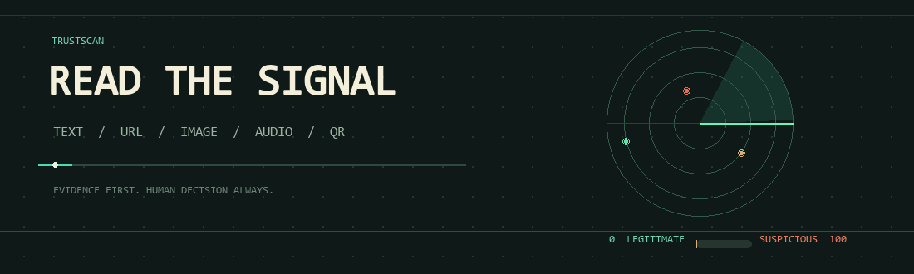

<div align="center">
  
  <h1>TrustScan</h1>
  <p><strong>Read the signal. Check the source. Keep a human in the loop.</strong></p>
  <p>Multimodal scam and trust analysis for messages, URLs, images, audio, and QR codes.</p>
</div>

---

## What It Does

TrustScan turns a suspicious message or media file into a readable, evidence-aware report. It uses Gemini for analysis and a local QR decoder to extract QR contents from uploaded images.

| Capability | Details |
| --- | --- |
| Text and URLs | Accepts text in multiple languages. URL page text is fetched when available; an unreachable page falls back to analysis of the URL itself. |
| Images and audio | Analyze up to five files per scan, with a 10 MB limit per file. |
| QR codes | Decode QR contents in uploaded images, include them in the analysis, and show the decoded payload and source filename. QR destinations are not opened automatically. |
| Suspicion score | 0 means fully legitimate; 100 means highly suspicious. The report also includes a verdict, confidence, summary, red flags, and verification suggestions. |
| Follow-up chat | Ask questions about the current report. Replies follow the language of the question. |

> **Important:** TrustScan provides an AI assessment, not proof. Verify important claims independently. Do not use a scan as the sole basis for financial, legal, medical, or safety decisions.

## Quick Start

**Requirements:** Python 3.11 or newer and a Gemini API key.

1. Create and activate a virtual environment.

   **Windows PowerShell**
   ```powershell
   py -3.11 -m venv .venv
   .\.venv\Scripts\Activate.ps1
   ```

   **macOS / Linux**
   ```bash
   python3.11 -m venv .venv
   source .venv/bin/activate
   ```

2. Install dependencies and create your local environment file.

   ```bash
   python -m pip install --upgrade pip
   pip install -r requirements.txt
   ```

   On Windows PowerShell, create the environment file with:
   ```powershell
   Copy-Item .env.example .env
   ```

   Add your Gemini API key to `.env`:
   ```dotenv
   GEMINI_API_KEY=your_api_key_here
   ```

   `GEMINI_MODEL` and `GEMINI_SEARCH_MODEL` are optional; defaults are provided in `.env.example`.

3. Start the app from the repository root.

   ```bash
   uvicorn app.main:app --reload
   ```

4. Open [http://127.0.0.1:8000](http://127.0.0.1:8000). The interactive API docs are at [http://127.0.0.1:8000/docs](http://127.0.0.1:8000/docs).

Keep `.env` private. It is ignored by Git.

## API

### `POST /api/scan`

Submit optional text and either the legacy `file` field or repeated `files` fields as `multipart/form-data`. Up to five files are accepted; each must be 10 MB or smaller.

```bash
curl -X POST http://127.0.0.1:8000/api/scan \
  -F "text=Check this message" \
  -F "files=@message.png" \
  -F "files=@voice-note.wav"
```

Supported uploads: PNG, JPEG, WebP, MPEG audio, WAV, OGG, and MP4 audio.

The response contains an `analysis` object, optional `provenance`, and a `qr_codes` array. Each decoded QR entry includes its source `file_name` and decoded `content`.

### `POST /api/chat`

Send a report and a question as JSON. `history` is optional.

```json
{
  "question": "What should I verify first?",
  "scan": {
    "analysis": {
      "trust_score": 72,
      "verdict": "Suspicious",
      "confidence": "medium",
      "summary": "Example report summary",
      "red_flags": [],
      "legit_signals": [],
      "verify_yourself": [],
      "claims_to_verify": []
    },
    "provenance": null,
    "qr_codes": []
  },
  "history": []
}
```

### `GET /health`

Returns `{"status":"ok"}` when the API process is running.

## Project Layout

```text
app/
  routers/       Scan and chat API endpoints
  services/      Gemini, URL reading, provenance, and QR decoding
  config.py      Environment and upload settings
  schemas.py     API request and response models
static/
  index.html     Frontend application
samples/         Example scan response payloads
requirements.txt Python dependencies
```

## Trust and Privacy

- Scores are assessments, not verification guarantees. A low score does not prove a message is safe.
- URL pages and QR payloads are treated as untrusted input. QR links are decoded for analysis but are not opened automatically.
- Avoid submitting passwords, authentication codes, payment details, or other sensitive personal information.
- The app sends submitted text and media to the configured Gemini service for analysis. Review that service's data policies before using sensitive material.
